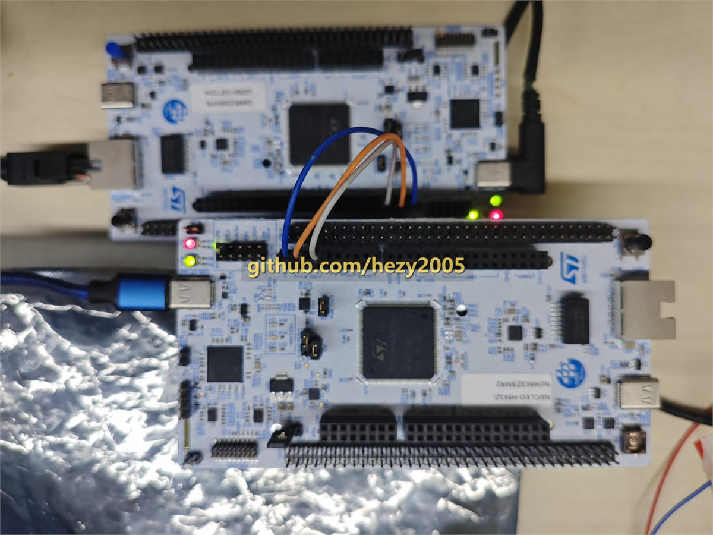
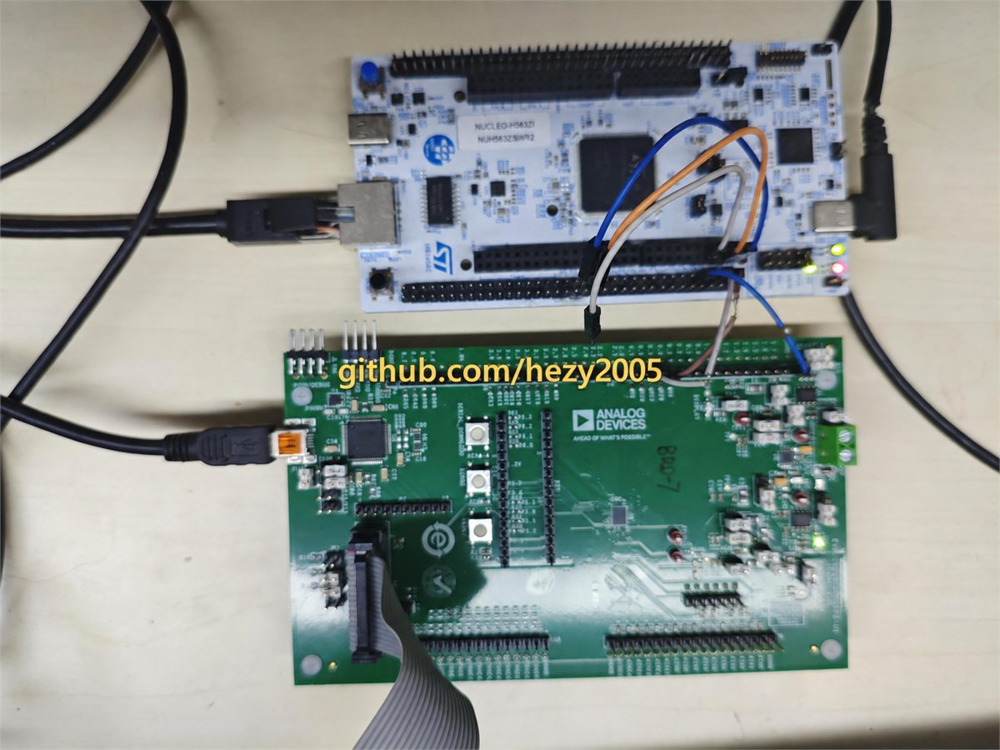
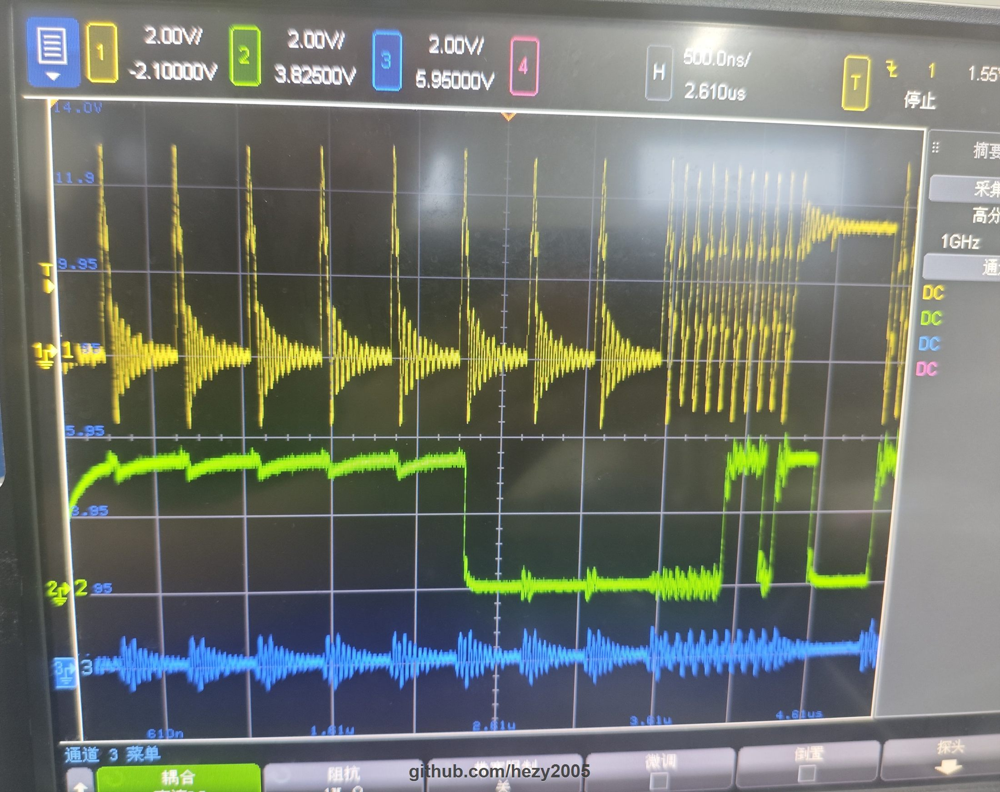
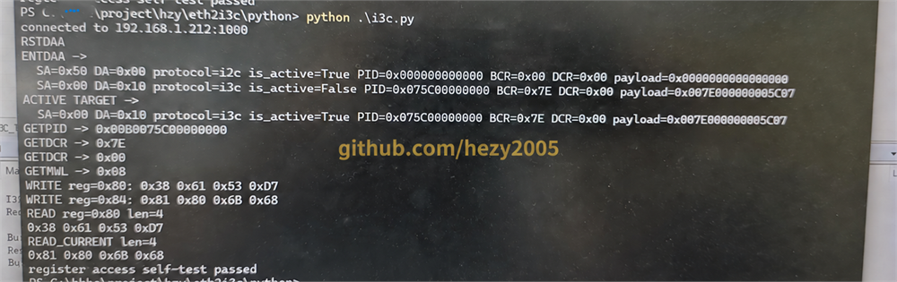

# eth2i3c：基于 STM32H563 的以太网转 I2C/I3C 网关

`eth2i3c` 是运行在 STM32H563 上的嵌入式协议网关。PC 通过 TCP 发送命令，网关完成 I2C/I3C
目标发现、CCC 操作和寄存器访问，并将结果返回给 Python 客户端。

项目使用 FreeRTOS、CMSIS-RTOS2 和 FreeRTOS+TCP，面向硬件调试、器件验证及 I3C 协议学习。
配套 Target 固件位于 [eth2i3c_target](https://github.com/hezy2005/eth2i3c_target)。



## 系统结构

```text
┌──────────────────┐      TCP :1000       ┌──────────────────────────────┐
│ PC / Python 客户端 │ ───────────────────> │ STM32H563 Controller         │
└──────────────────┘                       │ FreeRTOS + FreeRTOS-Plus-TCP │
                                           └──────────────┬───────────────┘
                                                          │ I3C1: PB8 / PB9
                                                          ▼
                                           ┌──────────────────────────────┐
                                           │ I3C/I2C Target               │
                                           │ 可使用配套 eth2i3c_target    │
                                           └──────────────────────────────┘
```

数据链路分为三层：

1. Python 客户端将高级 API 转换为单行 TCP 命令。
2. STM32H563 解析命令，维护 Target 信息，并调用 I3C Controller 驱动。
3. I3C/I2C Target 执行 CCC 或寄存器读写操作。

## 主要功能

- 使用静态 IPv4 地址 `192.168.1.212`，TCP 服务端口为 `1000`。
- 同一时间服务一个 TCP 客户端，连接断开后可接受新的客户端。
- 支持 `RSTDAA`、`ENTDAA`、`GETPID`、`GETBCR`、`GETDCR`、`GETMWL`、`GETMRL`、
  `GETSTATUS`、`SETMWL`、`SETMRL`、`ENEC` 和 `DISEC`。
- 支持按照静态地址（SA）或动态地址（DA）创建、绑定和选择 Target。
- 支持为 Target 指定 I2C 或 I3C 访问协议。
- 支持寄存器 random write、random read 和 current read。
- 提供不依赖第三方 Python 包的测试客户端及寄存器自检流程。
- 同时维护 IAR EWARM 和 STM32CubeIDE 工程。

项目只维护一个 I3C Controller 实例，不包含多 Controller 管理、monitor、风扇、电源或 GPIO 等无关命令。

## 硬件连接

Controller 和配套 Target 均使用
[NUCLEO-H563ZI](https://www.st.com/en/evaluation-tools/nucleo-h563zi.html)，即搭载 STM32H563ZIT6 的
STM32H5 Nucleo-144 开发板（MB1404，用户手册 UM3115）。Controller 同时使用板载以太网接口和
I3C1。

| 信号    | Controller | Target | Nucleo-144 接口 |
| ------- | ---------  | -----  | --------------- |
| I3C SCL | PB8        | PB8    | CN7 pin 2       |
| I3C SDA | PB9        | PB9    | CN7 pin 4       |
| GND     | GND        | GND    | CN7 pin8        |

两块板必须共地，I3C 连线应尽量短。12.5 MHz 下如信号质量不理想，可分别让一根地线与 SCL、SDA
绞合，以减小回流路径和串扰。Controller 通过 RMII 连接板载 LAN8742A PHY。

`BusFreeDuration` 与板卡、走线和总线负载有关。当前值基于 MB1404 双板环境调试；更换 Target、线长或
拓扑后，应结合波形重新验证该参数。

### 第三方 Target 兼容性验证

除配套的 STM32H563 Target 外，Controller 还与一块采用 ADI 器件的第三方 Target 板完成了通信验证，
说明 Controller 能够与不同厂商的 I3C Target 协同工作。该 ADI Target 仅用于兼容性测试，不属于
`eth2i3c_target` 项目。



## 实机验证

项目已通过双板通信、Python 寄存器自检和示波器波形验证。下图记录了 ENTDAA 中的广播地址、CCC 和
T-bit。I3C 会在同一事务中切换 open-drain 与 push-pull 时序，所以 `0x7E` 地址段较慢，而密集的数据段
以 12.5 MHz 运行。



完整的 ENTDAA、4 字节 private read 波形和时钟计算见
[I3C 波形分析](docs/i3c-waveform-analysis.md)。

### 验证范围

| 验证项 | 环境 | 结果 |
| --- | --- | --- |
| Controller clean build | IAR 9.50.2 | 通过 |
| Controller clean build | STM32CubeIDE 1.17.0 | 通过 |
| RSTDAA、ENTDAA 和常用 CCC | STM32H563 Target | 通过 |
| Random write、random read、current read | 256 字节寄存器模型 | 通过 |
| Python 自检与 TCP 重新连接 | Windows / Python 3.8 | 通过 |
| 跨厂商 Target 通信 | ADI Target | 通过 |

## 软件设计

- 应用任务和同步对象优先使用 CMSIS-RTOS2 API。
- FreeRTOS+TCP 及 STM32 网络接口适配层按中间件要求直接使用 FreeRTOS API。
- TCP 服务负责连接管理、按行接收命令并返回文本响应。
- 命令层只保留 I2C/I3C 相关操作。
- I3C 总线层封装初始化、DMA、回调、CCC 和 private transfer。
- Target 表统一保存 SA、DA、协议、活动状态及 PID/BCR/DCR 信息。

FreeRTOS+TCP 的 `phyHandling.c` 可识别 LAN8742A，并通过 STM32 HAL MDIO 接口访问 PHY，因此工程不再
重复链接 ST BSP 中的 `lan8742.c`。

## 仓库布局

```text
eth2i3c/
├── Inc/                 # 应用及网络配置头文件
├── Src/                 # TCP、命令解析和 I3C Controller 实现
├── python/i3c.py        # Python API 与自检程序
├── EWARM/               # IAR Embedded Workbench 工程
├── STM32CubeIDE/        # STM32CubeIDE 工程
├── docs/                # 设计记录、波形分析及展示图片
├── DEPENDENCIES.md      # 依赖版本与目录搭建方法
├── THIRD_PARTY_NOTICES.md
├── eth2i3c.ioc          # STM32CubeMX 配置
└── i3c_cmd_format.txt   # 原始 TCP 命令格式
```

工程通过 `../common` 引用 STM32H5 Drivers、CMSIS、CMSIS-FreeRTOS 和 FreeRTOS-Plus-TCP：

```text
workspace/
├── common/
├── eth2i3c/
└── eth2i3c_target/
```

准确版本和依赖获取方式见 [构建依赖](DEPENDENCIES.md)。

## 编译与运行

### 1. 编译固件

- IAR EWARM：打开 `EWARM/Project.eww`，选择 `eth2i3c` configuration。
- STM32CubeIDE：导入 `STM32CubeIDE` 目录，选择 `Debug` configuration。
- 开发板：NUCLEO-H563ZI（STM32H5 Nucleo-144，MB1404）。
- MCU：STM32H563ZIT6，系统时钟 250 MHz，I3C 速率 12.5 MHz。

编译并烧录后，串口应按以下顺序输出初始化信息：

```text
eth2i3c starting...
I3C controller initialized
FreeRTOS kernel starting...
Network up: 192.168.1.212
TCP Server listening on PORT 1000..
```

### 2. 配置网络

将 PC 配置到 `192.168.1.0/24` 网段，并确认没有其他设备使用 `192.168.1.212`。

| 参数 | 值 |
| --- | --- |
| 设备地址 | `192.168.1.212` |
| 子网掩码 | `255.255.255.0` |
| 默认网关 | `192.168.1.1` |
| TCP 端口 | `1000` |

### 3. 运行 Python 自检

```powershell
python python/i3c.py --host 192.168.1.212 --port 1000
```

自检会执行动态地址分配、读取 Target 信息、修改 MWL/MRL，并验证 random write、random read 和
current read。



## Python API 示例

```python
from i3c import I3CController

c = I3CController()

c.rstdaa()
targets = c.entdaa()
print(targets)

# 根据 ENTDAA 返回的实际动态地址选择 Target。
target = next(target for target in targets if target.da != 0)
c.target_set_active_by_da(target.da)

print(hex(c.getpid()))
print(hex(c.getbcr()))
print(hex(c.getdcr()))

c.w(0x80, [0x10, 0x20, 0x30, 0x40])
print(c.r(0x80, 4))
print(c.r_current(4))
c.h(0x00, 0x100, print_addr_ahead=True)
```

Target 管理接口包括：

- `target_create_by_sa()`
- `target_list()` / `targets`
- `target_set_active_by_sa()` / `target_set_active_by_da()`
- `target_bind()`
- `target_negotiate_i3c_by_sa()`
- `target_set_protocol_by_sa()` / `target_set_protocol_by_da()`

原始 TCP 命令及响应格式见 [i3c_cmd_format.txt](i3c_cmd_format.txt)。

## 技术文档

- [设计与调试记录](docs/design-notes.md)：TCP 随机数、连接生命周期、跨工具链格式化和模块边界。
- [I3C 波形分析](docs/i3c-waveform-analysis.md)：ENTDAA、private read、OD/PP 时序和 12.5 MHz 计算。
- [串口日志配置](docs/serial-console.md)：ST-LINK Virtual COM Port、115200 8N1 和启动日志。
- [构建依赖](DEPENDENCIES.md)：第三方源码版本、目录结构和工具链版本。

## 配套 Target

[eth2i3c_target](https://github.com/hezy2005/eth2i3c_target) 在另一块 STM32H563 上实现中断驱动的
I3C Target 和 256 字节寄存器模型，适合在没有真实 I3C 器件时完成端到端测试。

## 扩展方向

本项目不仅可作为以太网转 I2C/I3C 调试工具，也可作为嵌入式协议测试平台的基础框架。用户可以复用
现有的 TCP 通信、命令解析、Target 管理和硬件访问分层，进一步扩展 SPI 等总线协议，并增加吞吐率、
事务延迟、连续传输稳定性和错误率等 benchmark 测试。SPI 和 benchmark 属于扩展方向，当前版本尚未实现。

## 当前限制

- 使用固定 IPv4 地址，不包含 DHCP 配置界面。
- 同一时间只处理一个 TCP 客户端。
- 当前命令协议为面向调试的文本协议，没有认证和加密，不建议直接暴露到不可信网络。
- 公共库通过仓库外的 `../common` 引用，构建时需要保持上述目录结构。

## 许可证

项目代码按 [BSD 3-Clause License](LICENSE) 发布。STM32CubeH5、CMSIS-FreeRTOS 和
FreeRTOS-Plus-TCP 等组件的版权及许可证见 [第三方软件声明](THIRD_PARTY_NOTICES.md)。
