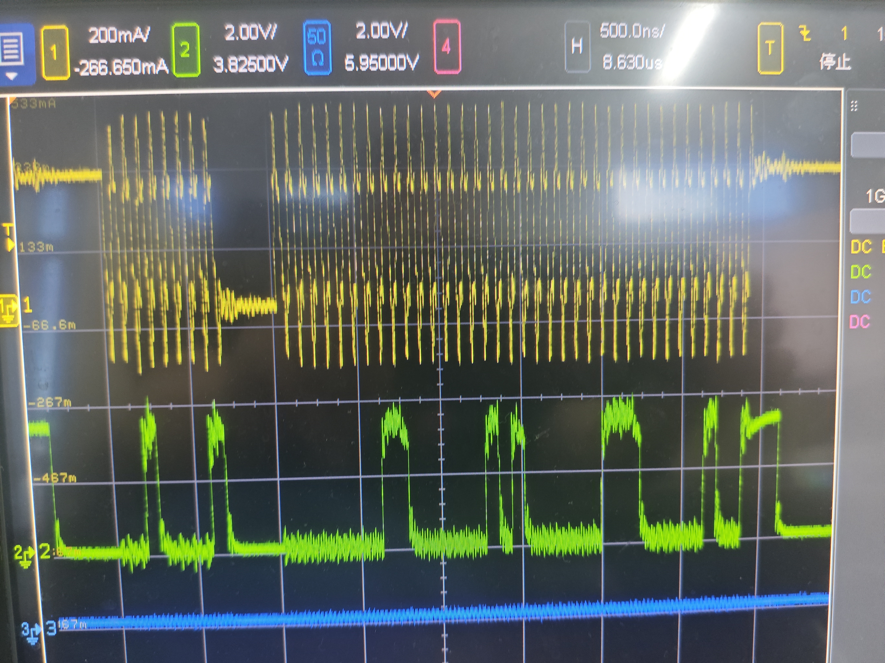

# I3C 总线波形分析

[返回项目 README](../README.md)

本文记录 `eth2i3c` 在 NUCLEO-H563ZI（MB1404）双板环境中的示波器验证结果。照片使用
`500 ns/div` 时基抓取，黄色高频脉冲用于观察 SCL 时序。

I3C 会在同一事务中切换 open-drain（OD）和 push-pull（PP）阶段，不能用整帧的平均周期判断
push-pull 数据阶段是否达到 12.5 MHz。

## ENTDAA 广播流程


该图对应以下总线内容：

```text
Broadcast Address 0x7E + ACK -> ENTDAA CCC 0x07 -> T-bit / DAA 后续阶段
```

第一次 START 后的广播地址 `0x7E` 使用较慢的 open-drain 时序，使仍启用 I2C spike filter 的 I3C
Target 能可靠识别广播地址。ENTDAA 还包含仲裁、ACK/T-bit 等 open-drain 阶段，因此这部分波形明显
慢于 12.5 MHz，这是协议预期行为。

## 4 字节 private read



该图对应从动态地址 `0x10` 读取以下数据：

```text
0x01 0x02 0x03 0x04
```

START 后的地址阶段和 ACK/T-bit 使用 open-drain 低电平时序；数据位使用 push-pull 时序。图中密集的
时钟段是 12.5 MHz 数据阶段，每个字节之间较长的位周期来自 T-bit。

## 当前时钟参数

I3C kernel clock 为 250 MHz，单个 kernel clock 周期为 4 ns。当前 `eth2i3c.ioc` 配置为：

```text
SCLI3CHighDuration = 0x09
SCLPPLowDuration   = 0x09
SCLODLowDuration   = 0x7C
```

对应的理论时序为：

```text
PP high = (0x09 + 1) × 4 ns = 40 ns
PP low  = (0x09 + 1) × 4 ns = 40 ns
PP frequency = 1 / (40 ns + 40 ns) = 12.5 MHz

OD high = (0x09 + 1) × 4 ns = 40 ns
OD low  = (0x7C + 1) × 4 ns = 500 ns
OD equivalent frequency ≈ 1 / (40 ns + 500 ns) ≈ 1.85 MHz
```

因此，`0x7E` 地址阶段看起来不是 12.5 MHz，并非配置错误。12.5 MHz 指 push-pull 数据位的时钟；
地址、ACK、T-bit 和仲裁等 open-drain 阶段使用约 1.85 MHz 的当前配置。实际 OD 波形还会受到上拉电阻、
线长、探头负载和上升时间影响。

在 `500 ns/div` 下：

- 12.5 MHz 的一个周期为 80 ns，约为 `0.16 div`，每格约有 6.25 个时钟；
- open-drain 的一个理论周期约为 540 ns，约为 `1.08 div`，接近每格一个时钟。

这与照片中“密集段”和“稀疏段”的差异一致。

## 测量注意事项

- 尽量使用短接地弹簧，避免长探头地线引入额外振铃。
- 探头负载、上拉电阻、线长和双板接地方式都会影响 open-drain 上升时间。
- 评估 12.5 MHz 时应测量连续 push-pull 数据位，不应把地址、ACK 或 T-bit 计入平均周期。
- 若更换 Target 或总线拓扑，应重新验证 `BusFreeDuration` 和 open-drain 低电平时间。

## 参考资料

- [MIPI I3C 常见问题](https://www.mipi.org/resources/I3C-frequently-asked-questions)
- [ST NUCLEO-H563ZI 产品页面](https://www.st.com/en/evaluation-tools/nucleo-h563zi.html)
- ST AN5879：*Introduction to I3C for STM32H5 series MCU*
