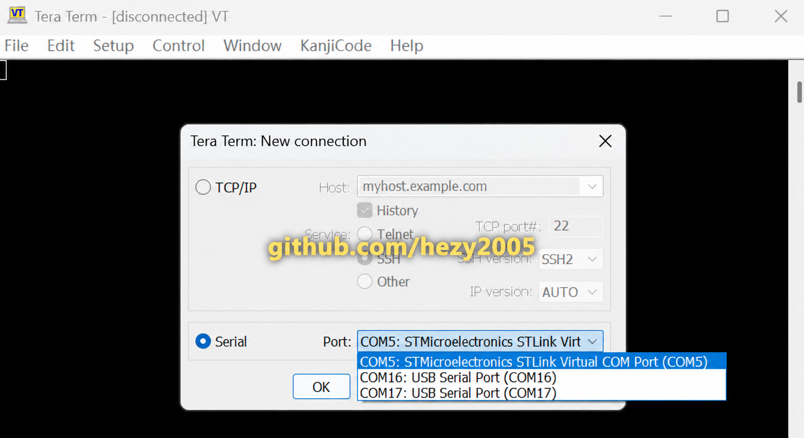
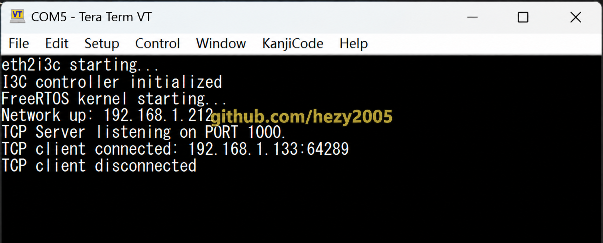

# 串口日志配置

[返回项目 README](../README.md)

Controller 通过 NUCLEO-H563ZI 板载 ST-LINK Virtual COM Port 输出启动、网络和 TCP 连接日志。

## 串口参数

| 参数 | 值 |
| --- | --- |
| 外设 | USART3 |
| TX / RX | PD8 / PD9 |
| 波特率 | 115200 |
| 数据位 | 8 |
| 校验位 | None |
| 停止位 | 1 |
| 流控 | None |

## 选择串口

在 Tera Term 或其他串口终端中，选择名称包含 `STMicroelectronics STLink Virtual COM Port` 的端口。
实际 COM 编号由 Windows 分配，不要求与截图一致。



## 正常启动日志

```text
eth2i3c starting...
I3C controller initialized
FreeRTOS kernel starting...
Network up: 192.168.1.212
TCP Server listening on PORT 1000..
```



Python 客户端连接后，会额外输出客户端地址和端口。若日志中出现 I3C error，应先检查 Target 是否上电、
PB8/PB9 是否接反、两块板是否共地，以及 ENTDAA 是否已经完成。
